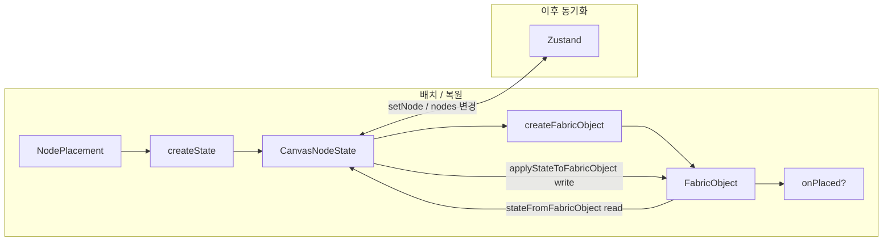

# 노드 시스템

Canvas 에디터의 확장 가능한 노드 아키텍처입니다.

## 핵심 개념

**노드** = 캔버스 위의 하나의 UI 요소 (텍스트, 향후 사각형·이미지 등)

각 노드는 두 표현을 가집니다:

1. **State** (`CanvasNodeState`) — Zustand store의 직렬화 가능한 데이터
2. **Fabric Object** — Fabric.js 캔버스 위의 렌더링 객체

## NodeDefinition

모든 노드 타입은 `NodeDefinition`을 구현합니다:

```typescript
// stores/nodes/types.ts
interface NodeDefinition {
  type: string;
  tool: string;
  label: string;
  shortcut?: string;
  icon?: string;
  cursor?: string;

  createState: (placement: NodePlacement) => BaseNodeState;
  createFabricObject: (state: BaseNodeState) => FabricObject;
  stateFromFabricObject: (object: FabricObject) => CanvasNodeState;
  applyStateToFabricObject: (object: FabricObject, state: CanvasNodeState) => void;
  onPlaced?: (object: FabricObject, canvas: Canvas) => void;
}
```

### 왜 State와 Fabric을 둘 다 쓰나

| | Fabric Object | Zustand (`CanvasNodeState`) |
|---|---------------|----------------------------|
| 역할 | 그리기, 드래그, 리사이즈, 인라인 편집 | 저장, 노드 목록, 속성 패널, undo |
| 형태 | `Textbox` 등 라이브 객체 (메서드·이벤트) | 직렬화 가능한 plain JSON |

Fabric만 쓰면 persist·패널·store 밖 로직이 Fabric API에 묶입니다. Store만 쓰면 화면 렌더링·조작을 할 수 없습니다. 그래서 **둘 다 유지**하고, 아래 5개 메서드로 맞춥니다.

### 메서드 역할 요약

| 메서드 | 시점 | 하는 일 |
|--------|------|---------|
| `createState` | 배치(최초 1회) | 클릭 좌표(`NodePlacement`)로 **초기 store 상태** 생성 |
| `createFabricObject` | 배치·복원(객체 없을 때) | store 상태로 **Fabric 객체를 새로 생성** (`new Textbox(...)`) |
| `stateFromFabricObject` | 배치 이후(sync) | Fabric에서 값을 **읽어** `CanvasNodeState`로 변환 |
| `applyStateToFabricObject` | 배치 이후(sync) | `CanvasNodeState`를 **기존 Fabric 객체에 반영** (`object.set(...)`) |
| `onPlaced` | 배치 직후(선택) | 배치 후 UX 후처리 (텍스트: 편집 모드 진입) |

`createState` / `createFabricObject`는 **처음 만들 때**, `stateFromFabricObject` / `applyStateToFabricObject`는 **이후 계속 맞출 때** 사용합니다.

### `createFabricObject` vs `applyStateToFabricObject`

둘 다 store → Fabric 방향이지만 역할이 다릅니다.

- **`createFabricObject`**: 캔버스에 아직 없을 때 **생성자**로 객체를 만듦. `data: { nodeId, nodeType }` 메타데이터도 여기서 설정.
- **`applyStateToFabricObject`**: 이미 캔버스에 있는 객체의 속성만 **갱신**. 속성 패널·undo·store 복원 시 사용.

복원(`createFabricObjectFromState`)에서는 생성 직후 `applyStateToFabricObject`를 한 번 더 호출해 상태를 완전히 맞춥니다 (`features/canvas/utils/nodes.ts`).

### Sync: Fabric read / write

`stateFromFabricObject`와 `applyStateToFabricObject`는 **Zustand API가 아닙니다**. Fabric ↔ `CanvasNodeState` **변환기**이며, read/write 관점은 **Fabric 기준**입니다.

| | Fabric 관점 | Zustand는 누가 갱신? |
|---|-------------|----------------------|
| `stateFromFabricObject` | **read** — Textbox 등에서 속성을 읽음 | 호출부가 `setNode` / `updateNode` |
| `applyStateToFabricObject` | **write** — `object.set(...)` 등으로 반영 | 호출부가 store에서 `state`를 넘김 |

```
[사용자가 캔버스 조작]
  Fabric 변경
    → stateFromFabricObject()   (Fabric read)
    → setNode(state)            (Zustand write)

[store만 변경 — 패널, undo, 복원 등]
  nodes[id] 변경
    → applyStateToFabricObject() (Fabric write)
```

실제 sync 오케스트레이션은 `features/canvas/hooks/useCanvasNodes.ts`가 담당합니다.

- **Fabric → store**: `object:modified`, `text:changed` 등 → `stateFromFabricObject` → `setNode`
- **store → Fabric**: `nodes` 변경 시 Fabric 상태와 비교 후 다르면 → `applyStateToFabricObject`

유틸 래퍼: `features/canvas/utils/nodes.ts` (`stateFromFabricObject`, `applyStateToFabricObject`, `applyNodeStateToCanvas`, `createFabricObjectFromState`)



## 레지스트리

`stores/nodes/registry.ts`:

```typescript
export const NODE_DEFINITIONS = {
  text: textNodeDefinition,
} as const;

export const TOOL_TO_NODE = {
  text: textNodeDefinition,
};
```

타입 추론:

```typescript
type NodeType = keyof typeof NODE_DEFINITIONS;  // 'text'
type NodeTool = (typeof NODE_DEFINITIONS)[NodeType]['tool'];  // 'text'
```

## 텍스트 노드 예시

### 상태 (`stores/nodes/text/index.ts`)

```typescript
interface TextNodeState extends BaseNodeState {
  type: 'text';
  text: string;
  fontSize: number;
  color: string | null;
  fill: string | null;
  stroke: string | null;
}
```

### Fabric 매핑 (`stores/nodes/text/definition.ts`)

| 메서드 | 텍스트 노드 동작 |
|--------|------------------|
| `createState` | `createTextNodeState` — 클릭 좌표에 초기 TextNodeState |
| `createFabricObject` | `new Textbox(...)` |
| `stateFromFabricObject` | Textbox 속성 → `TextNodeState` (Fabric read) |
| `applyStateToFabricObject` | `TextNodeState` → `textbox.set(...)` (Fabric write) |
| `onPlaced` | `enterEditing` + `selectAll` |

### Fabric 메타데이터

모든 Fabric 객체에 `data: { nodeId, nodeType }`를 설정합니다. selection/sync에서 ID를 추출하는 데 사용됩니다.

## 배치 (Placement)

`features/canvas/drawing/placement.ts`의 `attachPlacement`:

1. 도구 활성화 시 canvas에 `mouse:down` 리스너 등록
2. 클릭 위치에 `createState(placement)` → `createFabricObject(state)` → `canvas.add` → `addNode(state)`
3. `onComplete` → `setTool('move')`
4. `onPlaced` 콜백 (텍스트: 편집 모드)

## Base Node Fields

`stores/nodes/base.ts`, `stores/nodes/fabric.ts`:

공통 필드(position, size, visibility, locked, opacity)를 `BaseNodeState`와 `readBaseNodeFields` / `applyBaseNodeFields` 유틸로 관리합니다.

## 노드 라벨

`features/canvas/labels/NodeLabelsOverlay.tsx`가 DOM 오버레이로 노드 ID/타입 라벨을 표시합니다. Fabric viewportTransform을 따라 좌표를 변환합니다.

## 확장 가이드

새 노드 추가 절차는 [노드 추가하기](/guide/adding-nodes)를 참고하세요.

## 관련 문서

- [프론트엔드](/architecture/frontend)
- [상태 관리](/architecture/state-management)
