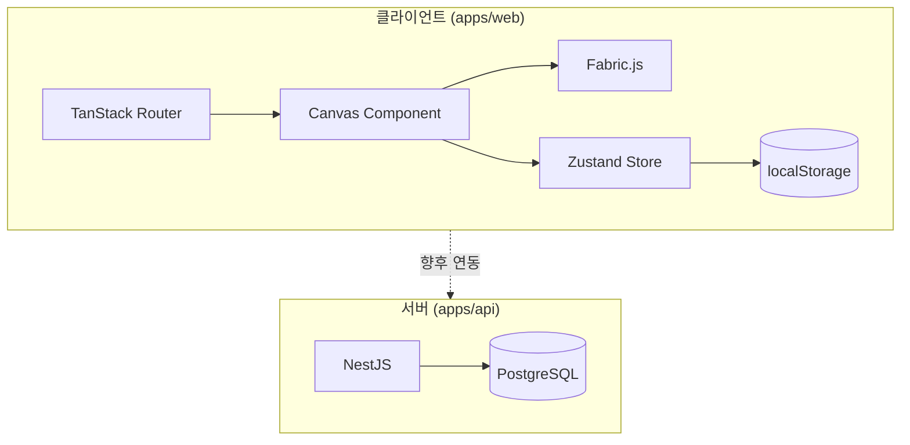

# 아키텍처 개요

Canvas 프로젝트의 전체 아키텍처와 설계 원칙입니다.

## 시스템 구성



현재 에디터는 **클라이언트 전용**으로 동작하며, 상태는 localStorage에 persist됩니다. API/DB는 향후 문서 저장·협업·인증 등에 활용될 예정입니다.

## 설계 원칙

### 1. 단일 진실 공급원 (Store-first)

Fabric.js 객체는 **뷰 표현**이고, Zustand store의 `nodes`가 **데이터 진실 공급원**입니다. hooks가 양방향 동기화를 담당합니다.

### 2. 커맨드 패턴

모든 에디터 동작(도구 전환, 줌, 선택, 삭제)은 `Command` 인터페이스로 선언됩니다. 단축키(`useGlobalShortcuts`)와 UI 버튼이 동일한 `executeCommand`를 호출합니다.

### 3. 선언적 노드 확장

새 노드 타입은 `NodeDefinition` 하나로 등록하면 도구 커맨드, 배치, 동기화가 자동 연결됩니다.

### 4. Feature 모듈화

캔버스 관련 로직은 `features/canvas/`에 hooks + utils로 분리하고, `components/canvas/`는 얇은 React 래퍼만 유지합니다.

### 5. 모노레포 공유

타입·DTO·설정은 `packages/`에서 공유해 web/api 간 중복을 방지합니다.

## 레이어 구조 (web)

```
routes/          → 페이지 & 레이아웃
components/      → 재사용 UI (canvas, sidebar, ui)
features/        → 도메인 hooks & utils (canvas, shortcuts)
stores/          → 전역 상태 (commands, nodes, persistence)
lib/             → 범용 유틸
```

## 주요 데이터 타입

```typescript
// AppState = Canvas + History + Selection + Editor + Nodes
type AppState = CanvasState & HistoryState & SelectionState & EditorState & NodesState;

// Tool = 'move' | NodeTool
type Tool = 'move' | 'text' | ...;

// CanvasNodeState = TextNodeState | ...
type CanvasNodeState = TextNodeState | ...;
```

## 관련 문서

- [모노레포 구조](/architecture/monorepo)
- [프론트엔드](/architecture/frontend)
- [상태 관리](/architecture/state-management)
- [노드 시스템](/architecture/node-system)
- [백엔드](/architecture/backend)
