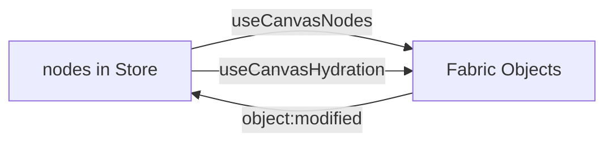

# 상태 관리

Zustand 기반 전역 상태 설계입니다.

## 스토어 구조

`useAppStore`는 5개 slice를 합성합니다:

```typescript
useAppStore = create(
  persist(
    devtools(
      (...a) => ({
        ...createCanvasSlice(...a),    // tool, zoom, position
        ...createHistorySlice(...a),   // undo/redo
        ...createSelectionSlice(...a), // selectedIds
        ...createEditorSlice(...a),    // sidebar, labels
        ...createNodesSlice(...a),     // nodes, nodeOrder
      })
    ),
    { name: 'canvas-app-v1', version: 2, partialize }
  )
);
```

## Slice 상세

### CanvasSlice

| 상태 | 타입 | 설명 |
|------|------|------|
| `tool` | `'move' \| NodeTool` | 현재 활성 도구 |
| `zoom` | `number` | 줌 레벨 |
| `position` | `{ x, y }` | 팬 오프셋 |
| `canvasSize` | `{ width, height }` | 캔버스 DOM 크기 |

### HistorySlice

Undo/Redo 스택. 노드 추가·수정·삭제 시 히스토리에 기록됩니다.

### SelectionSlice

| 상태 | 설명 |
|------|------|
| `selectedIds` | 선택된 노드 ID 배열 |
| `deleteSelectionRequest` | 삭제 트리거 (side effect용) |

### EditorSlice

| 상태 | 기본값 | 설명 |
|------|--------|------|
| `isPropertiesSidebarOpen` | `true` | 속성 패널 표시 |
| `isVisibleNodeLabels` | `true` | 노드 라벨 표시 |

### NodesSlice

| 상태 | 설명 |
|------|------|
| `nodes` | `Record<id, CanvasNodeState>` |
| `nodeOrder` | 렌더링/z-index 순서 |

## 커맨드 시스템

모든 사용자 동작은 `Command`로 선언됩니다:

```typescript
interface Command {
  id: string;
  label: string;
  shortcut?: string;
  group?: string;
  isActive?: (store) => boolean;
  isDisabled?: (store) => boolean;
  execute: (store) => void;
}
```

실행:

```typescript
executeCommand('history.undo', store);
```

커맨드 그룹:

| group | 예시 |
|-------|------|
| `tools` | move, text |
| `history` | undo, redo |
| `selections` | selectAll, delete |
| `views` | zoomIn, zoomOut, zoomToFit |
| `editor` | togglePropertiesSidebar |

## Persist (localStorage)

`stores/persistence/appStorage.ts`:

```typescript
export const PERSIST_GROUPS = {
  document: ['nodes', 'nodeOrder'],
  preferences: ['isPropertiesSidebarOpen', 'isVisibleNodeLabels'],
};
```

- **document** — 작업 데이터
- **preferences** — UI 설정

`partializeAppState`가 persist 대상만 추출합니다. 새 persist 필드는 `PERSIST_GROUPS`에 추가하세요.

### 버전 관리

```typescript
export const APP_STORAGE_KEY = 'canvas-app-v1';
export const APP_STORAGE_VERSION = 2;
```

스키마 변경 시 `version`을 올리고 `migrate` 함수를 추가하는 것을 권장합니다.

## Fabric ↔ Store 동기화



- **Hydration**: 앱 시작 시 store → Fabric 일괄 복원
- **Sync**: 실시간 양방향 (이동, 리사이즈, 텍스트 편집)
- **Placement**: 새 노드 생성 시 store + Fabric 동시 추가

## Devtools

Redux DevTools Extension으로 `app-store` 이름으로 inspect 가능합니다.

## 관련 문서

- [노드 시스템](/architecture/node-system)
- [단축키 & 커맨드](/reference/commands)
