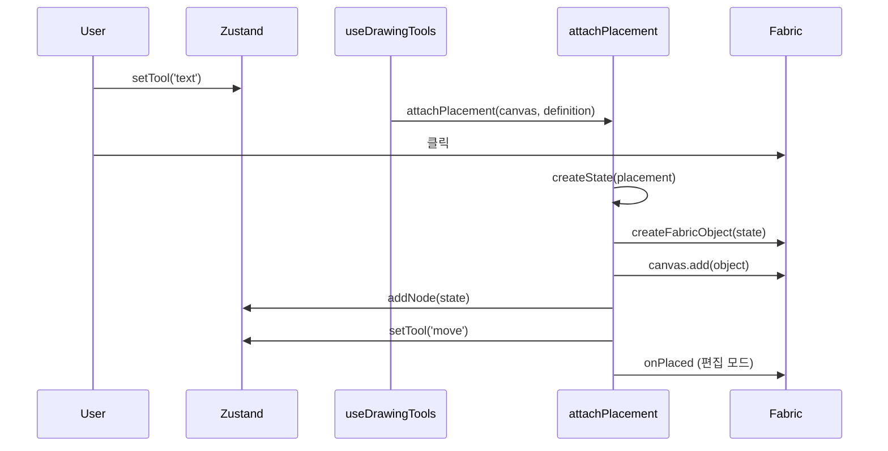

# 노드 추가하기

새 노드 타입을 Canvas 에디터에 추가하는 방법입니다.

## 개념

노드는 **상태(Zustand) ↔ Fabric 객체** 양방향 매핑으로 관리됩니다. 각 노드 타입은 `NodeDefinition` 인터페이스를 구현합니다.

## NodeDefinition 인터페이스

```typescript
interface NodeDefinition {
  type: string;           // 노드 타입 ID
  tool: string;           // 도구 ID (store.tool 값)
  label: string;          // UI 표시명
  shortcut?: string;      // 단축키
  icon?: string;          // 아이콘
  cursor?: string;        // 배치 시 커서

  createState: (placement: NodePlacement) => CanvasNodeState;
  createFabricObject: (state: BaseNodeState) => FabricObject;
  stateFromFabricObject: (object: FabricObject) => CanvasNodeState;
  applyStateToFabricObject: (object: FabricObject, state: CanvasNodeState) => void;
  onPlaced?: (object: FabricObject, canvas: Canvas) => void;
}
```

### 메서드별 구현 포인트

| 메서드 | 구현 시 기억할 점 |
|--------|-------------------|
| `createState` | `placement.x/y`와 선택적 `width`/`height`로 초기 state + 새 `id` |
| `createFabricObject` | `new`로 객체 생성, `data: { nodeId, nodeType }` 필수 |
| `stateFromFabricObject` | Fabric **read** — 드래그·편집 후 store로 올릴 값 추출 (Zustand는 호출부가 갱신) |
| `applyStateToFabricObject` | Fabric **write** — store 변경을 `object.set` 등으로 반영 |
| `onPlaced` | 타입별 배치 직후 UX (텍스트: `enterEditing`) |

`createFabricObject`는 **생성**, `applyStateToFabricObject`는 **이미 있는 객체 갱신**입니다. 상세·sync 흐름은 [노드 시스템](/architecture/node-system)을 참고하세요.

## 추가 절차 (체크리스트)

### 1. 상태 타입 정의

`apps/web/src/stores/nodes/<type>/index.ts`에 노드 상태 타입과 `createState(placement)` 팩토리를 작성합니다. `placement`에는 클릭 좌표(`x`, `y`)와 선택적 `width`/`height`가 전달됩니다.

텍스트 노드 참고: `stores/nodes/text/index.ts`

### 2. NodeDefinition 구현

`apps/web/src/stores/nodes/<type>/definition.ts`에 Fabric 객체 생성·동기화 로직을 구현합니다.

텍스트 노드 참고: `stores/nodes/text/definition.ts`

### 3. 레지스트리 등록

`apps/web/src/stores/nodes/registry.ts`:

```typescript
import { myNodeDefinition } from './myType/definition';

export const NODE_DEFINITIONS = {
  text: textNodeDefinition,
  myType: myNodeDefinition,  // 추가
} as const satisfies Record<string, NodeDefinition>;

export const TOOL_TO_NODE: Record<NodeTool, NodeDefinition> = {
  text: textNodeDefinition,
  myType: myNodeDefinition,  // 추가
};
```

### 4. Tool 타입 확장

`NodeTool`은 `NODE_DEFINITIONS`에서 자동 추론됩니다. `Tool` 타입은 `'move' | NodeTool`입니다.

### 5. 커맨드 자동 등록

`stores/commands/index.ts`의 `TOOL_COMMANDS`는 `NODE_DEFINITIONS`를 순회해 도구 커맨드를 자동 생성합니다. **별도 커맨드 등록 불필요**.

### 6. 속성 패널 (선택)

Properties Sidebar에 노드별 편집 UI를 추가하려면 `components/propertiesSidebar/`를 확장합니다. 현재 사이드바는 placeholder 메뉴만 포함합니다.

## 배치 흐름



배치 이후 캔버스 조작 ↔ store 동기화는 `useCanvasNodes`가 `stateFromFabricObject`(Fabric read)와 `applyStateToFabricObject`(Fabric write)로 처리합니다.

핵심 파일:

- 배치: `features/canvas/drawing/placement.ts`
- 동기화: `features/canvas/hooks/useCanvasNodes.ts`, `features/canvas/utils/nodes.ts`

## persist 주의사항

새 노드 상태 필드가 `CanvasNodeState` 유니온에 포함되면 `nodes`/`nodeOrder`를 통해 자동 persist됩니다.

스키마 변경 시 `APP_STORAGE_VERSION`을 올리고 migrate 로직을 추가하는 것을 권장합니다.

## 다음 단계

[아키텍처 개요 →](/architecture/overview)
