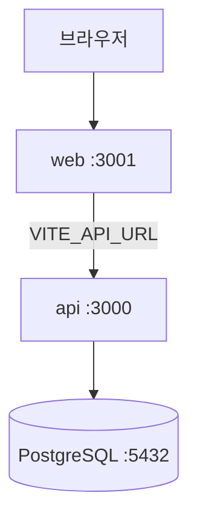

# Docker 개발

Docker Compose를 사용해 web, api, PostgreSQL을 통합 실행하는 방법입니다.

## 사전 준비

- Docker Engine + Docker Compose v2
- `.env.dev` 파일 (프로젝트 루트)

```env
DB_PASSWORD=example_password
VITE_API_URL=http://localhost:3000
NODE_ENV=development
```

## 실행

```bash
# 일반 실행
pnpm docker:dev

# 이미지 재빌드 후 실행
pnpm docker:dev:build

# 종료
pnpm docker:down
```

루트 `package.json` 스크립트:

```json
"docker:dev": "docker compose -f docker-compose.yml -f docker-compose.dev.yml --env-file .env.dev up"
```

## 서비스 구성

### web (포트 3001)

- Dockerfile: `apps/web/Dockerfile.dev`
- `turbo prune web --docker`로 최소 의존성만 설치
- 소스 볼륨 마운트로 HMR 지원

### api (포트 3000)

- Dockerfile: `apps/api/Dockerfile.dev`
- `DATABASE_URL`로 PostgreSQL 연결
- DB healthcheck 통과 후 기동

### db (PostgreSQL 17)

- 사용자: `postgres`
- DB: `mydb`
- 볼륨: `postgres_data` (데이터 영속)

## 아키텍처 다이어그램



## docs 앱

현재 Docker Compose에는 docs 서비스가 포함되어 있지 않습니다. 문서 사이트는 로컬에서 별도 실행하세요:

```bash
pnpm --filter docs dev
```

## 프로덕션

```bash
pnpm docker:prod
```

`docker-compose.prod.yml`과 `.env.prod`를 사용합니다.

## 트러블 shooting

| 증상               | 해결                                              |
| ------------------ | ------------------------------------------------- |
| api가 db 연결 실패 | db healthcheck 완료 대기, `DB_PASSWORD` 일치 확인 |
| web HMR 안 됨      | 볼륨 마운트 경로 확인, 컨테이너 재시작            |
| 포트 충돌          | 3000/3001/5432 사용 프로세스 확인                 |

## 다음 단계

[캔버스 사용법 →](/guide/canvas-usage)
