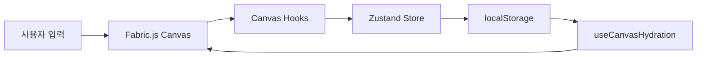

# 코드베이스 투어

Canvas 모노레포의 주요 디렉터리와 파일을 빠르게 둘러봅니다.

## 최상위 구조

```
canvas/
├── apps/
│   ├── web/          # React + Vite 캔버스 에디터 (포트 3001)
│   ├── api/          # NestJS REST API (포트 3000)
│   └── docs/         # VitePress 문서 사이트 (포트 8000)
├── packages/
│   ├── api/          # 공유 DTO, 엔티티
│   ├── eslint-config/
│   ├── jest-config/
│   └── typescript-config/
├── docker-compose.yml
├── turbo.json
└── pnpm-workspace.yaml
```

## apps/web — 프론트엔드

핵심 진입점과 디렉터리:

| 경로                      | 역할                                      |
| ------------------------- | ----------------------------------------- |
| `src/main.tsx`            | React 앱 부트스트랩, TanStack Router 등록 |
| `src/routes/`             | 파일 기반 라우트 (`/`, `/canvas`)         |
| `src/components/canvas/`  | Fabric.js 캔버스 React 래퍼 + 줌/좌표 HUD |
| `src/features/canvas/`    | 캔버스 hooks, 유틸, 라벨 오버레이         |
| `src/stores/commands/`    | Zustand 스토어 + 커맨드 정의              |
| `src/stores/nodes/`       | 노드 타입 레지스트리 및 정의              |
| `src/stores/persistence/` | localStorage persist 설정                 |
| `src/components/ui/`      | shadcn/ui 기반 UI 컴포넌트                |

### 라우팅

```
/                 → 홈 (캔버스로 이동 링크)
/canvas           → 레이아웃 (속성 사이드바)
/canvas/          → 캔버스 에디터 페이지
```

TanStack Router의 파일 기반 라우팅을 사용하며, `routeTree.gen.ts`는 플러그인이 자동 생성합니다.

### Canvas 컴포넌트 hooks 체인

`components/canvas/index.tsx`는 다음 hooks를 조합합니다:

```
useFabricCanvas        → Fabric Canvas 인스턴스 생성
useGlobalShortcuts     → 전역 단축키 처리
useCanvasCamera        → 줌/팬 카메라
useCanvasViewportWheel → 휠 줌/팬
useCanvasHydration     → localStorage → Fabric 동기화
useDrawingTools        → 도구별 노드 배치
useCanvasSelection     → Fabric selection ↔ selectedIds, 삭제 처리
useCanvasNodes         → Zustand ↔ Fabric 양방향 sync (이동·편집·삭제)
```

추가로 자주 볼 유틸:

- `features/canvas/utils/canvasSync.ts` — sync 루프/상호작용 중 guard
- `features/canvas/utils/textboxScaling.ts` — 텍스트박스 폭 리사이즈·스케일 정규화
- `features/canvas/utils/handleViewportWheel.ts` — 휠 줌/팬

## apps/api — 백엔드

NestJS 기반 REST API입니다.

| 경로                | 역할                            |
| ------------------- | ------------------------------- |
| `src/main.ts`       | 앱 부트스트랩 (CORS, 포트 3000) |
| `src/app.module.ts` | 루트 모듈                       |
| `src/links/`        | Links CRUD 예제 모듈            |

현재 API는 기본 스캐폴딩 단계이며, 향후 캔버스 문서 저장·공유 기능과 연동될 예정입니다.

## packages/ — 공유 패키지

| 패키지                    | 용도                              |
| ------------------------- | --------------------------------- |
| `@repo/api`               | 프론트/백엔드 공유 DTO, 엔티티    |
| `@repo/eslint-config`     | ESLint 설정 preset                |
| `@repo/typescript-config` | tsconfig preset (vite, nestjs 등) |
| `@repo/jest-config`       | Jest 설정 preset                  |

## 데이터 흐름 (캔버스)



## 읽어볼 핵심 파일 (우선순위)

1. `apps/web/src/stores/commands/index.ts` — 커맨드 + 스토어 생성
2. `apps/web/src/stores/nodes/text/definition.ts` — 텍스트 노드 정의 예시
3. `apps/web/src/features/canvas/hooks/useCanvasNodes.ts` — Fabric ↔ store 동기화
4. `apps/web/src/features/canvas/drawing/placement.ts` — 노드 배치 로직
5. `apps/web/src/features/canvas/utils/hydrateCanvas.ts` — persist 복원
6. `apps/web/src/features/shortcuts/hooks/useGlobalShortcuts.ts` — 단축키 처리

## 다음 단계

[아키텍처 개요 →](/architecture/overview)
